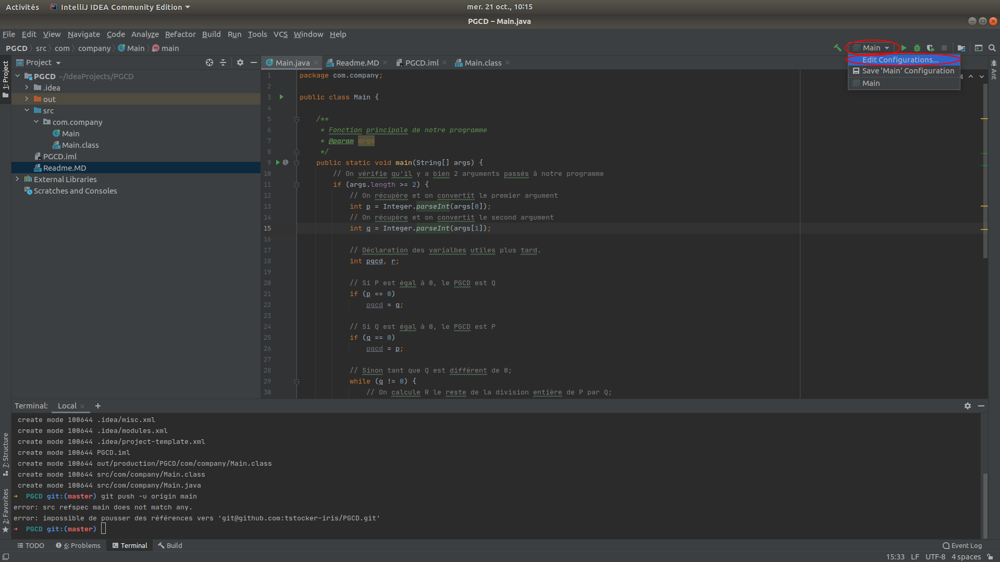
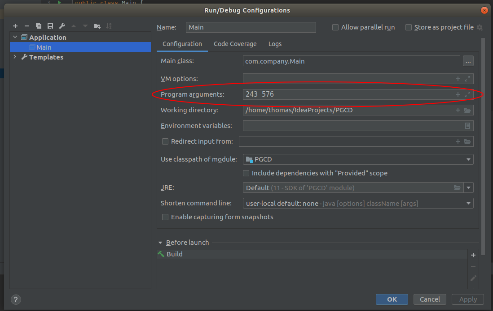

# Exercice PGCD
## Ajouter des paramètres à l'éxecution de notre programme

Cliquer sur le select en haut à droite de l'écran et cliquer sur l'option "Edit Configurations"

Puis entrer les arguments dans l'input "Program arguments"

